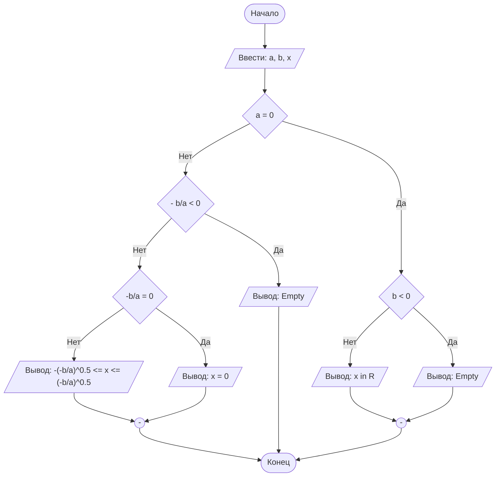

## Отчет по лабораторной работе № 1

#### № группы: `ПМ-2502`

#### Выполнил: `Загидулина Ева Артуровна`

#### Вариант: `6`

### Cодержание:

- [Постановка задачи](#1-постановка-задачи)
- [Входные и выходные данные](#2-входные-и-выходные-данные)
- [Выбор структуры данных](#3-выбор-структуры-данных)
- [Алгоритм](#4-алгоритм)
- [Программа](#5-программа)
- [Анализ правильности решения](#6-анализ-правильности-решения)

### 1. Постановка задачи

> Дано неравенство: (x + a)/(b * x) >= 0, где a и b - параметры (вводятся с клавиатуры). Решите его для x.

- Нужно получить общее аналитическое решение неравенства, ответом будет являтся множество значений x (интервалы), удовлетворяющее условию неравенства. Требуется написать программу, читающую параметры a и b и выводящую множество решений. Необходимо так же описать все частные случаи. Пример:
  1. Если параметр b = 0, то у данного неравенства нет решений
  2. Если b = 1, a = 1, то решение (-∞, -1];(0, +∞)
 
### 2. Входные и выходные данные
**Входные данные:**
- a - параметр, вещественное число. Количество: 1. Диапазон: любое вещественное число
- b - параметр, вещественное число. Количество: 1. Диапазон: любое вещественное число, кроме 0.

**Выходные данные:**
- множество решений x в виде объединения интервалов или сообщение об отсутствии решения, тип: строка.

### 2,5. Математическая модель

Рассмотрим выражение (x + a)/(b * x) >= 0. Область определения: x и b принадлежат (-∞, 0);(0, +∞).

Для b не равному 0 знак дроби равен знаку произведения b* x * (x+a). Следовательно неравенство равносильно (при условии x не равному 0):

b * x * (x+a) >= 0

В итоге задача сводится к исследованию знака трёх множителей b, x, (x+a). Критические точки: x = 0, x = -a, в них неравенство будет менять знак, следовательно именно эти точки будут в ответе, -a всегда будет вколотой точкой, а 0 выколотой.


**Итоговый вид решения:**
 - Если b > 0: требуется x(x+a) >= 0 при x не равном 0. То есть
x принадлежит (- ∞, min(-a, 0)];[max(-a, 0), + ∞) с исключением x = 0.
- Если b<0: требуется x(x+a) <= 0 при x не равном 0. То есть
x принадлежит [min(-a, 0), max(-a, 0)] с исключением x = 0.
- Если b=0: выражение не определено для всех x → решений нет.

**Подробный разбор знаков:**

1. Если b>0:
- a > 0 (-a < 0): x принадлежит (-∞, -a];(0, +∞).
- a = 0: x принадлежит (- ∞, 0);(0, +∞).
- a < 0 (-a > 0): x принадлежит (-∞, 0);[-a, +∞).

2. Если b<0:
- a > 0 (-a < 0): x принадлежит [-a, 0).
- a = 0: решений нет.
- a < 0 (-a > 0): x принадлежит (0, -a].

### 3. Выбор структуры данных

Анализ (рассуждения) и обоснования того, где и как Вы собираетесь хранить всё то,
что нужно для работы программы.

### 4. Алгоритм

На русском языке подробно расписать, что и в каком порядке делает Ваша программа.

В 1 лабораторной работе блок-схем обязательна. Ниже представлен пример с лекции,
реализованный с помощью `mermaid` - инструментом для рисования диаграмм и блок-схем.

```markdown
    ```mermaid
        ([Начало]) --> B[/Ввести: a, b, x/]
        B --> C{a = 0}
        C -- Нет --> D{- b/a < 0}
        D -- Нет --> E{"-b/a = 0"}
        E -- Нет --> F[/"Вывод: -(-b/a)^0.5 <= x <= (-b/a)^0.5"/]
        E -- Да --> G[/Вывод: x = 0/]
        D -- Да --> H[/Вывод: Empty/]
        C -- Да --> I{b < 0}
        I -- Нет --> J[/Вывод: x in R/]
        I -- Да --> K[/Вывод: Empty/]
        J --> M(("-"))
        K --> M
        G --> L(("-"))
        H ----> Z
        F --> L
        M --> Z
        L --> Z([Конец])
    ``` 
```




`Mermaid` нативно интегрирован в `GitHub`, а для работы в Вашей среде разработке - нужно установить
плагин: `File` > `Settings` > `Plugins`.


### 5. Программа

Полный текст программы с комментариями на русском языке

Нужно вставить код прямо в отчет в блок:

```markdown
    ```java
        class Main{
            // Что-то далее
        }
    ``` 
```

Это будет выглядеть следующим образом:

```java
class Main{
    // Что-то далее
}
```

### 6. Анализ правильности решения

Привести тесты и анализ работы программы для этих тестов.
Очень неплохо было бы обосновать выбор тестов.

1. Тест на что-то

- Input:
    ```
    1
    1
    ```

- Output:
    ```
    2
    ```

2. Тест на что-то еще

- Input:
    ```
    1
    -1
    ```

- Output:
    ```
    0
    ```

# Критерии оценивания

Обратите внимание на то, что лабораторная работа должна быть выложена в отдельный репозиторий с названием LabN (N -
Номер лабы). В репозитории должно быть минимум 2 файла (README.md - отчет, Main.java - код лабы)

| **Критерий**                                                                                                                                                                           | **Баллы**       |
|----------------------------------------------------------------------------------------------------------------------------------------------------------------------------------------|-----------------|
| **Корректность программы**                                                                                                                                                             | **0** - **40**  |
| - Программа полностью выполняет задачу                                                                                                                                                 | 15              |
| - Нет ошибок выполнения                                                                                                                                                                | 10              |
| - Учтены все ограничения                                                                                                                                                               | 5               |
| - Правильное поведение в "крайних" случаях                                                                                                                                             | 10              |
|                                                                                                                                                                                        |                 |
| **Оптимизация кода**                                                                                                                                                                   | **0** - **20**  |
| - Эффективные алгоритмы                                                                                                                                                                | 10              |
| - Избежание избыточности и повторов                                                                                                                                                    | 5               |
| - Разумность использования структур данных                                                                                                                                             | 5               |
|                                                                                                                                                                                        |                 |
| **Читабельность и стиль кода**                                                                                                                                                         | **0** - **20**  |
| - Соблюдение стандартов форматирования                                                                                                                                                 | 5               |
| - Наличие комментариев, в полном объеме поясняющих написанный код                                                                                                                      | 10              |
| - Понятные имена переменных и функций                                                                                                                                                  | 5               |
|                                                                                                                                                                                        |                 |
| **Оформление отчета**                                                                                                                                                                  | **0** - **20**  |
| - Соблюдение структуры отчета                                                                                                                                                          | 5               |
| - Отчет загружен на GitHub в репозиторий с названием LabN (N - номер лабораторной работы), отчет в формате Markdown с названием README.md, также есть файл Main.java с кодом программы | Обязательно     |
| - Четкое описание алгоритма (блок-схема если нужна)                                                                                                                                    | 5               |
| - Полнота покрытия тестами всех случаев                                                                                                                                                | 5               |
| - Обоснования использования алгоритма, структур данных                                                                                                                                 | 5               |
|                                                                                                                                                                                        |                 |
| **Общая сумма**                                                                                                                                                                        | **0** - **100** |
