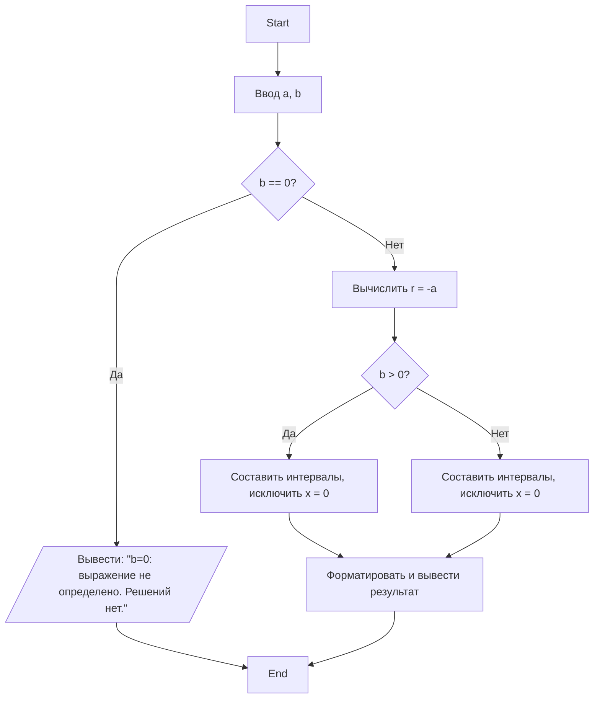

## Отчет по лабораторной работе № 1

#### № группы: `ПМ-2502`

#### Выполнил: `Загидулина Ева Артуровна`

#### Вариант: `6`

### Cодержание:

- [Постановка задачи](#1-постановка-задачи)
- [Входные и выходные данные](#2-входные-и-выходные-данные)
- [Выбор структуры данных](#3-выбор-структуры-данных)
- [Алгоритм](#4-алгоритм)
- [Программа](#5-программа)
- [Анализ правильности решения](#6-анализ-правильности-решения)

### 1. Постановка задачи

> Дано неравенство: (x + a)/(b * x) >= 0, где a и b - параметры (вводятся с клавиатуры). Решите его для x.

- Нужно получить общее аналитическое решение неравенства, ответом будет являтся множество значений x (интервалы), удовлетворяющее условию неравенства. Требуется написать программу, читающую параметры a и b и выводящую множество решений. Необходимо так же описать все частные случаи. Пример:
  1. Если параметр b = 0, то у данного неравенства нет решений
  2. Если b = 1, a = 1, то решение (-∞, -1]∪(0, +∞)
 
### 2. Входные и выходные данные
**Входные данные:**
- a - параметр, вещественное число. Количество: 1. Диапазон: любое вещественное число
- b - параметр, вещественное число. Количество: 1. Диапазон: любое вещественное число, кроме 0.

**Выходные данные:**
- множество решений x в виде объединения интервалов или сообщение об отсутствии решения, тип: строка.

### 2,5. Математическая модель

Рассмотрим выражение (x + a)/(b * x) >= 0. Область определения: x, b ∈ (-∞, 0)∪(0, +∞).

Для b не равному 0 знак дроби равен знаку произведения b * x * (x+a). Следовательно неравенство равносильно (при условии x не равному 0):

b * x * (x+a) >= 0

В итоге задача сводится к исследованию знака трёх множителей b, x, (x+a). Критические точки: x = 0, x = -a, в них неравенство будет менять знак, следовательно именно эти точки будут в ответе, -a всегда будет вколотой точкой, а 0 выколотой.


**Итоговый вид решения:**
 - Если b > 0: требуется x(x+a) >= 0 при x не равном 0. То есть
x ∈ (- ∞, min(-a, 0)]∪[max(-a, 0), + ∞) с исключением x = 0.
- Если b < 0: требуется x(x+a) <= 0 при x не равном 0. То есть
x ∈ [min(-a, 0), max(-a, 0)] с исключением x = 0.
- Если b = 0: выражение не определено для всех x, решений нет.

**Подробный разбор знаков:**

1. Если b > 0:
- a > 0 (-a < 0): x ∈ (-∞, -a]∪(0, +∞).
- a = 0: x ∈ (- ∞, 0)∪(0, +∞).
- a < 0 (-a > 0): x ∈ (-∞, 0)∪[-a, +∞).

2. Если b < 0:
- a > 0 (-a < 0): x ∈ [-a, 0).
- a = 0: решений нет.
- a < 0 (-a > 0): x ∈ (0, -a].

### 3. Выбор структуры данных

В данной реализации всё устроено максимально просто:
- Входные данные (a и b) хранятся в переменных типа double. Такой тип выбран, потому что параметры и решения могут быть не только целыми, но и вещественными числами.
- Для чтения входных значений используется объект Scanner. Он нужен только на этапе ввода, после чего закрывается.
- Решение задачи выводится сразу в виде строки (System.out.println(...)). Программа не хранит интервалы как отдельные структуры (например, массивы или списки), а сразу формирует текст результата.
- Это сделано потому, что программа рассчитана на взаимодействие «человек + компьютер»: результат нужен в читаемом виде (например, (-∞, -2] ∪ (0, +∞)), а не для дальнейших вычислений.

Таким образом, структура данных минимальна:
- числа (double) для параметров,
- строки (String) для вывода ответа.
 
### 4. Алгоритм

**1. Ввод данных**
- Программа считывает два вещественных числа: a и b.

**2. Проверка корректности знаменателя**
- Если b == 0, то знаменатель всегда ноль → выводим сообщение: «Нет решений» и завершение программы.
  
**3. Основные вычисления**
1) Вычислить ноль числителя = -a.
2) В зависимости от знака b:
- _Если b > 0_:
- - Если -a < 0, то решение: (-∞, c] ∪ (0, ∞).
  - Если -a > 0, то решение: (-∞, 0) ∪ [c, ∞).
  - Если -a == 0, то решение: R \ {0}.
- _Если b < 0_:
- - Если -a < 0, то решение: [c, 0).
  - Если -a > 0, то решение: (0, c].
  - Если -a == 0, то решений нет.

 **5. Вывод результата**
- Программа печатает интервал или объединение интервалов в текстовом виде.



### 5. Программа

```java
import java.util.Scanner;

public class Main {
    public static void main(String[] args) {
        Scanner sc = new Scanner(System.in);

        System.out.print("Введите a: ");
        double a = sc.nextDouble();

        System.out.print("Введите b: ");
        double b = sc.nextDouble();

        if (b == 0) {
            System.out.println("Нет решений, так как b = 0, знаменатель не может быть равен нулю");
            return;
        }

        System.out.println("Решаем неравенство (" + (a) + " + x)/(" + (b) + "*x) >= 0");

        if (b > 0) {
            if (a > 0) {
                System.out.println("Решение: x ∈ (-∞, " + (-a) + "] ∪ (0, +∞)");
            } else if (a == 0) {
                System.out.println("Решение: x ∈ (-∞, 0) ∪ (0, +∞)");
            } else { // a < 0
                System.out.println("Решение: x ∈ (-∞, 0) ∪ [" + (-a) + ", +∞)");
            }
        } else { // b < 0
            if (a > 0) {
                System.out.println("Решение: x ∈ [" + (-a) + ", 0)");
            } else if (a == 0) {
                System.out.println("Решений нет.");
            } else { // a < 0
                System.out.println("Решение: x ∈ (0, " + (-a) + "]");
            }
        }

        sc.close();
    }

```

### 6. Анализ правильности решения

Привести тесты и анализ работы программы для этих тестов.
Очень неплохо было бы обосновать выбор тестов.

1. Тест на что-то

- Input:
    ```
    1
    1
    ```

- Output:
    ```
    2
    ```

2. Тест на что-то еще

- Input:
    ```
    1
    -1
    ```

- Output:
    ```
    0
    ```
